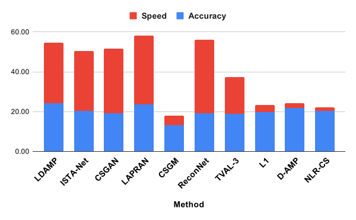

Technical report of this project: https://arxiv.org/abs/2103.00652
# Section 0: Benchmarking Scores

<table>
<thead>
  <tr>
    <th>Method</th>
    <th>Reconstruction Accuracy [0-50]</th>
    <th>Reconstruction Speed [0-50]</th>
    <th>Overall Score [0-100]</th>
  </tr>
</thead>
<tbody>
  <tr>
    <td>LAPRAN</td>
    <td>23.60</td>
    <td>34.69</td>
    <td>58.30</td>
  </tr>
  <tr>
    <td>ReconNet</td>
    <td>18.78</td>
    <td>37.00</td>
    <td>55.78</td>
  </tr>
  <tr>
    <td>Learned DAMP</td>
    <td>24.24</td>
    <td>30.25</td>
    <td>54.50</td>
  </tr>
  <tr>
    <td>CSGAN</td>
    <td>19.03</td>
    <td>32.58</td>
    <td>51.61</td>
  </tr>
  <tr>
    <td>ISTA-Net Plus</td>
    <td>20.40</td>
    <td>30.02</td>
    <td>50.42</td>
  </tr>
  <tr>
    <td>TVAL3</td>
    <td>18.92</td>
    <td>18.43</td>
    <td>37.35</td>
  </tr>
  <tr>
    <td>D-AMP</td>
    <td>21.83</td>
    <td>2.35</td>
    <td>24.19</td>
  </tr>
  <tr>
    <td>L1</td>
    <td>19.69</td>
    <td>3.78</td>
    <td>23.46</td>
  </tr>
  <tr>
    <td>NLR-CS</td>
    <td>20.35</td>
    <td>1.69</td>
    <td>22.04</td>
  </tr>
  <tr>
    <td>CSGM</td>
    <td>13.27</td>
    <td>4.75</td>
    <td>18.02</td>
  </tr>
</tbody>
</table>

More details about how scores are calculated and the benchmarking results may be found in `Details.md`.

 

# Section 1: Setting up environment

### Data-driven using conda (PyTorch):
`conda create -n CS_methods_environement python=3.7.9`  
`conda activate CS_methods_environement` 
 
`conda install pytorch==1.6.0 torchvision cudatoolkit=10.1 -c pytorch` 
`conda install opencv==3.4.2` 
`conda install scikit-image==0.17.2` 
`conda install pandas` 
 
 ### Data-driven using conda (Tensorflow):
`conda create -n CS_methods_environement python=3.7.9`  
`conda activate CS_methods_environement` 
 
`conda install tensorflow-gpu=1.15 cudatoolkit=10.0` 
`conda install opencv==3.4.2` 
`conda install scikit-image==0.17.2` 
`pip install pypng` 
`pip install PyWavelets` 
`pip install scipy==1.1.0` 
`pip install matplotlib` 
`pip install scikit-learn` 
`pip install cvxopt` 
`pip install Pillow` 

### Model-based using Matlab:
`cd \<path to CS-Framework directory\>` 
`run set_up.m` 

### Using the framework:
#### Data-driven using Python
To run the methods in Python, you may either modify the `main.py` file in each method's folder and run `python main.py`, or call it from another file and pass in custom arguments. Details about the specifics parameter may be found in each method's folder, and will require modification to properly work with different file structures. Note that the correct conda environment must be active for it to function properly.

Pre-trained models for each data-driven method may be downloaded from [this link](https://drive.google.com/drive/folders/15ibWTYwSrTiQwE0glrz0EBzXuiK7JS5s?usp=sharing). <!--ADD IN GOOGLE DRIVE LINK TO PRETRAINED MODELS-->

#### Model-based using Matlab
To run the methods in Matlab, you may either modify the `demo.m` file in the framework root directory and run it in Matlab, or call the `main.m` function from another file and pass in custom arguments. Details about the specifics parameter may be found in each method's folder. Note that `set_up.m` must be ran in each new session for it to function properly.

The data used for benchmarking every method may be downloaded from [this link](https://drive.google.com/drive/folders/15ibWTYwSrTiQwE0glrz0EBzXuiK7JS5s?usp=sharing). <!--ADD IN GOOGLE DRIVE LINK TO DATA-->

# Section 2: Parameters

sensing: Method of sensing 
reconstruction: Method of reconstruction 
stage: Training or testing 
default: [True] use original paper's parameters [False] manually set parameters 
dataset: Dataset to be used 
input_channel: # of channels training/testing images have 
input_width: Width of training/testing images 
input_height: Height of training/testing images 
m: # of measurements/outputs of sensing matrix 
n: # of inputs to sensing matrix 
specifics: Specific parameter settings of chosen reconstruction method 

# Section 3: List of Methods
### Model-based:
#### TVAL3
(Reference: https://www.caam.rice.edu/~zhang/reports/tr1213.pdf) 
(Repository: https://www.caam.rice.edu/~optimization/L1/TVAL3/) 

#### NLR-CS
(Reference: https://see.xidian.edu.cn/faculty/wsdong/Papers/Journal/NLR-CS-TIP.pdf) 
(Repository: http://see.xidian.edu.cn/faculty/wsdong/Code_release/NLR_codes.rar) 
* The definition of the size measurements has been changed to reflect the definition in L1-Magic. This affects the value of m in relation to the compression ratio.

#### D-AMP
(Reference: https://arxiv.org/pdf/1406.4175.pdf) 
(Repository: https://github.com/ricedsp/D-AMP_Toolbox) 
* The DNCNN denoiser is unsupported.

#### L1
(Reference: https://statweb.stanford.edu/~candes/software/l1magic/) 
(Repository: https://statweb.stanford.edu/~candes/software/l1magic/) 

### Data-driven:
#### LDAMP
(Reference: https://papers.nips.cc/paper/2017/file/8597a6cfa74defcbde3047c891d78f90-Paper.pdf) 
(Repository: https://github.com/ricedsp/D-AMP_Toolbox/tree/master/LDAMP_TensorFlow) 
* Only supports layer-by-layer training
* Supports gaussian, complex-gaussian, and coded-diffraction sensing for Layer-by-Layer (not Fast-JL)

#### ISTA-Net Plus
(Reference: https://openaccess.thecvf.com/content_cvpr_2018/papers_backup/Zhang_ISTA-Net_Interpretable_Optimization-Inspired_CVPR_2018_paper.pdf) 
(Repository: https://github.com/jianzhangcs/ISTA-Net) 
* Merged ISTANet and ISTANetPlus, now a parameter is used to control which one to train/test

#### ReconNet
(Reference: https://openaccess.thecvf.com/content_cvpr_2016/papers/Kulkarni_ReconNet_Non-Iterative_Reconstruction_CVPR_2016_paper.pdf) 
(Repository: https://github.com/KuldeepKulkarni/ReconNet) 

#### LAPRAN
(Reference: https://openaccess.thecvf.com/content_ECCV_2018/papers/Kai_Xu_LAPCSRA_Deep_Laplacian_ECCV_2018_paper.pdf) 
(Repository: https://github.com/PSCLab-ASU/LAPRAN-PyTorch) 

#### CSGM
(Reference: http://proceedings.mlr.press/v70/bora17a/bora17a.pdf) 
(Repository: https://github.com/AshishBora/csgm) 

#### CSGAN
(Reference: http://proceedings.mlr.press/v97/wu19d/wu19d.pdf) 
(Repository: https://github.com/deepmind/deepmind-research/tree/master/cs_gan) 
* To reproduce the results in the original paper, test the network with the same batch size that was used to train the network. Using different batch sizes affects the network's performance during testing because of the batch normalization layers in the generator.

All implementations of each method in this framework can reproduce the results in their original papers.
