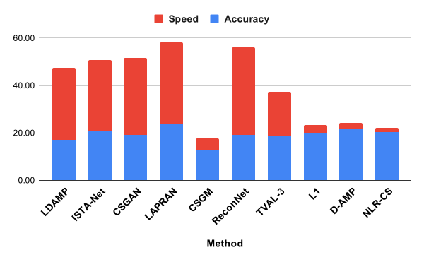

Technical report of this project: https://arxiv.org/abs/2103.00652
# Section 0: Benchmarking Scores

<table>
<thead>
  <tr>
    <th>Method</th>
    <th>Reconstruction Accuracy [0-50]</th>
    <th>Reconstruction Speed [0-50]</th>
    <th>Overall Score [0-100]</th>
  </tr>
</thead>
<tbody>
  <tr>
    <td>LAPRAN</td>
    <td>23.60</td>
    <td>34.69</td>
    <td>58.30</td>
  </tr>
  <tr>
    <td>ReconNet</td>
    <td>19.15</td>
    <td>37.00</td>
    <td>56.15</td>
  </tr>
  <tr>
    <td>CSGAN</td>
    <td>19.03</td>
    <td>32.58</td>
    <td>51.61</td>
  </tr>
  <tr>
    <td>ISTA-Net Plus</td>
    <td>20.69</td>
    <td>30.02</td>
    <td>50.71</td>
  </tr>
  <tr>
    <td>Learned DAMP</td>
    <td>17.21</td>
    <td>30.25</td>
    <td>47.46</td>
  </tr>
  <tr>
    <td>TVAL3</td>
    <td>18.92</td>
    <td>18.43</td>
    <td>37.35</td>
  </tr>
  <tr>
    <td>D-AMP</td>
    <td>21.83</td>
    <td>2.35</td>
    <td>24.19</td>
  </tr>
  <tr>
    <td>L1</td>
    <td>19.69</td>
    <td>3.78</td>
    <td>23.46</td>
  </tr>
  <tr>
    <td>NLR-CS</td>
    <td>20.35</td>
    <td>1.69</td>
    <td>22.04</td>
  </tr>
  <tr>
    <td>CSGM</td>
    <td>13.07</td>
    <td>4.75</td>
    <td>17.82</td>
  </tr>
</tbody>
</table>

More details about how scores are calculated and the benchmarking results may be found in `Details.md`.

<br>

# Section 1: Setting up environments

### Data-driven using Docker/conda:
There are two ways to set up the environment for the framework, one using Docker, and one using your local machine.<br>

#### Using Docker
Ensure that Docker is installed. Then, follow these steps:
1. Run `docker build . -t open_ics` to build the Docker image
2. Run `docker run -it --gpus all --name OpenICS open_ics` to start a Docker container with the previous image. The `--gpus all` tag may be replaced with whichever GPUs you would like the container to have access to, or removed entirely to run only on the CPU.

After following the above steps, you should have an interactive prompt where you can execute or edit code. The working directory should be named `code` and should have all the Python methods and code.<br>
To copy data or models to the container, run the following command:<br>
`docker cp {SOURCE PATH} OpenICS:{DESTINATION PATH}` where `{SOURCE PATH}` is the path to the data or models on your machine, and `{DESTINATION PATH}` is the desired path in the container. This command can also be used to copy data out of the container by reversing the arguments.<br>
The `nano` editor comes installed with the container, so files may be modified using the `nano` command.<br>

#### Using Local Machine
Ensure that conda is installed. Then, navigate to the `environment` directory and run the following two commands:<br>
`conda env create -f OpenICS_Pytorch.yml`<br>
`conda env create -f OpenICS_Tensorflow.yml`<br>

#### Further Considerations
Both these approaches will create conda environments `OpenICS_Pytorch` for Pytorch methods, and `OpenICS_Tensorflow` for Tensorflow methods.
To active either, run `conda activate {ENV NAME}` where `{ENV NAME}` is the name of the conda environment.
Pytorch methods include: ReconNet, LAPRAN, ISTANet, and CSGAN.
Tensorflow methods include: LDAMP and CSGM.
The corresponding environment must be activated for these methods to run.

### Model-based using MATLAB:
Launch MATLAB and use the command window to run the following commands:<br>
`cd \<path to OpenICS directory\>`<br>
`run set_up.m`<br>
Note that MATLAB is not included in the Docker image due to it being licensed software. You will need to install it separately and run methods outside of the container.

### Using the framework:
#### Data-driven using Python
To run the methods in Python, you may either modify the `main.py` file in each method's folder and run `python main.py`, or call it from another file and pass in custom arguments. Details about the specifics parameter may be found in each method's folder, and will require modification to properly work with different file structures. Note that the correct conda environment must be active for it to function properly.

Pre-trained models for each data-driven method may be downloaded from [this link](https://drive.google.com/drive/folders/15ibWTYwSrTiQwE0glrz0EBzXuiK7JS5s?usp=sharing). <!--ADD IN GOOGLE DRIVE LINK TO PRETRAINED MODELS-->

#### Model-based using Matlab
To run the methods in Matlab, you may either modify the `demo.m` file in the framework root directory and run it in Matlab, or call the `main.m` function from another file and pass in custom arguments. Details about the specifics parameter may be found in each method's folder. Note that `set_up.m` must be ran in each new session for it to function properly.

The data used for benchmarking every method may be downloaded from [this link](https://drive.google.com/drive/folders/15ibWTYwSrTiQwE0glrz0EBzXuiK7JS5s?usp=sharing). <!--ADD IN GOOGLE DRIVE LINK TO DATA-->

# Section 2: Parameters

sensing: Method of sensing</br>
reconstruction: Method of reconstruction</br>
stage: Training or testing</br>
default: [True] use original paper's parameters [False] manually set parameters</br>
dataset: Dataset to be used</br>
input_channel: # of channels training/testing images have</br>
input_width: Width of training/testing images</br>
input_height: Height of training/testing images</br>
m: # of measurements/outputs of sensing matrix</br>
n: # of inputs to sensing matrix</br>
specifics: Specific parameter settings of chosen reconstruction method</br>


# Section 3: List of Methods
### Model-based:
#### TVAL3
(Reference: https://www.caam.rice.edu/~zhang/reports/tr1213.pdf)</br>
(Repository: https://www.caam.rice.edu/~optimization/L1/TVAL3/)</br>

#### NLR-CS
(Reference: https://see.xidian.edu.cn/faculty/wsdong/Papers/Journal/NLR-CS-TIP.pdf)</br>
(Repository: http://see.xidian.edu.cn/faculty/wsdong/Code_release/NLR_codes.rar)</br>
* The definition of the size measurements has been changed to reflect the definition in L1-Magic. This affects the value of m in relation to the compression ratio.

#### D-AMP
(Reference: https://arxiv.org/pdf/1406.4175.pdf)</br>
(Repository: https://github.com/ricedsp/D-AMP_Toolbox)</br>
* The DNCNN denoiser is unsupported.

#### L1
(Reference: https://statweb.stanford.edu/~candes/software/l1magic/)</br>
(Repository: https://statweb.stanford.edu/~candes/software/l1magic/)</br>


### Data-driven:
#### LDAMP
(Reference: https://papers.nips.cc/paper/2017/file/8597a6cfa74defcbde3047c891d78f90-Paper.pdf)</br>
(Repository: https://github.com/ricedsp/D-AMP_Toolbox/tree/master/LDAMP_TensorFlow)</br>
* Only supports layer-by-layer training
* Supports gaussian, complex-gaussian, and coded-diffraction sensing for Layer-by-Layer (not Fast-JL)

#### ISTA-Net Plus
(Reference: https://openaccess.thecvf.com/content_cvpr_2018/papers_backup/Zhang_ISTA-Net_Interpretable_Optimization-Inspired_CVPR_2018_paper.pdf)</br>
(Repository: https://github.com/jianzhangcs/ISTA-Net)</br>
* Merged ISTANet and ISTANetPlus, now a parameter is used to control which one to train/test

#### ReconNet
(Reference: https://openaccess.thecvf.com/content_cvpr_2016/papers/Kulkarni_ReconNet_Non-Iterative_Reconstruction_CVPR_2016_paper.pdf)</br>
(Repository: https://github.com/KuldeepKulkarni/ReconNet)</br>

#### LAPRAN
(Reference: https://openaccess.thecvf.com/content_ECCV_2018/papers/Kai_Xu_LAPCSRA_Deep_Laplacian_ECCV_2018_paper.pdf)</br>
(Repository: https://github.com/PSCLab-ASU/LAPRAN-PyTorch)</br>

#### CSGM
(Reference: http://proceedings.mlr.press/v70/bora17a/bora17a.pdf)</br>
(Repository: https://github.com/AshishBora/csgm)</br>

#### CSGAN
(Reference: http://proceedings.mlr.press/v97/wu19d/wu19d.pdf)</br>
(Repository: https://github.com/deepmind/deepmind-research/tree/master/cs_gan)</br>
* To reproduce the results in the original paper, test the network with the same batch size that was used to train the network. Using different batch sizes affects the network's performance during testing because of the batch normalization layers in the generator.

All implementations of each method in this framework can reproduce the results in their original papers.

Please cite our paper published on Software Impact as well as our technical report if you use OpenICS in your work

```
@article{ZHAO2021100081,
title = {OpenICS: Open image compressive sensing toolbox and benchmark},
journal = {Software Impacts},
pages = {100081},
year = {2021},
issn = {2665-9638},
doi = {https://doi.org/10.1016/j.simpa.2021.100081},
url = {https://www.sciencedirect.com/science/article/pii/S2665963821000282},
author = {Jonathan Zhao and Márk Lakatos-Tóth and Matthew Westerham and Zhikang Zhang and Avi Moskoff and Fengbo Ren},
keywords = {Compressive sensing, Computer vision, Machine learning, Signal processing, Image processing},
abstract = {The real-world application of image compressive sensing is largely limited by the lack of standardization in implementation and evaluation. To address this limitation, we present OpenICS, an image compressive sensing toolbox that implements multiple popular image compressive sensing algorithms into a unified framework with a standardized user interface. Furthermore, a corresponding benchmark is also proposed to provide a fair and complete evaluation of the implemented algorithms. We hope this work can serve the growing research community of compressive sensing and the industry to facilitate the development and application of image compressive sensing.}
}
```

```
@article{zhao2021openics,
  title={OpenICS: Open Image Compressive Sensing Toolbox and Benchmark},
  author={Zhao, Jonathan and Westerham, Matthew and Lakatos-Toth, Mark and Zhang, Zhikang and Moskoff, Avi and Ren, Fengbo},
  journal={arXiv preprint arXiv:2103.00652},
  year={2021}
}
```
